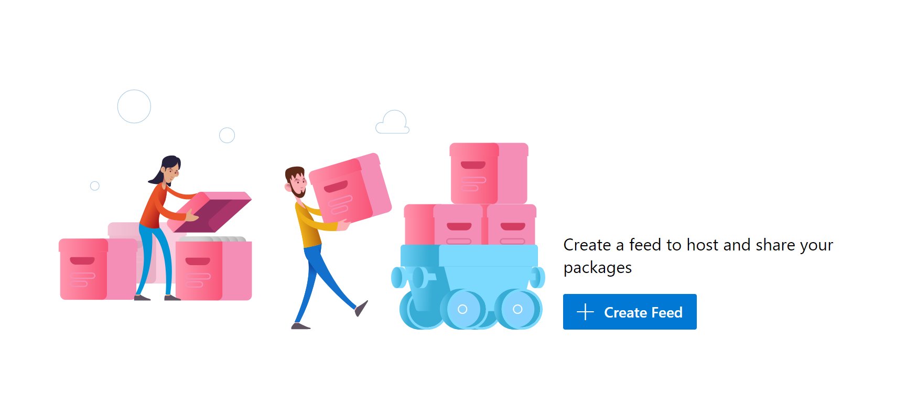
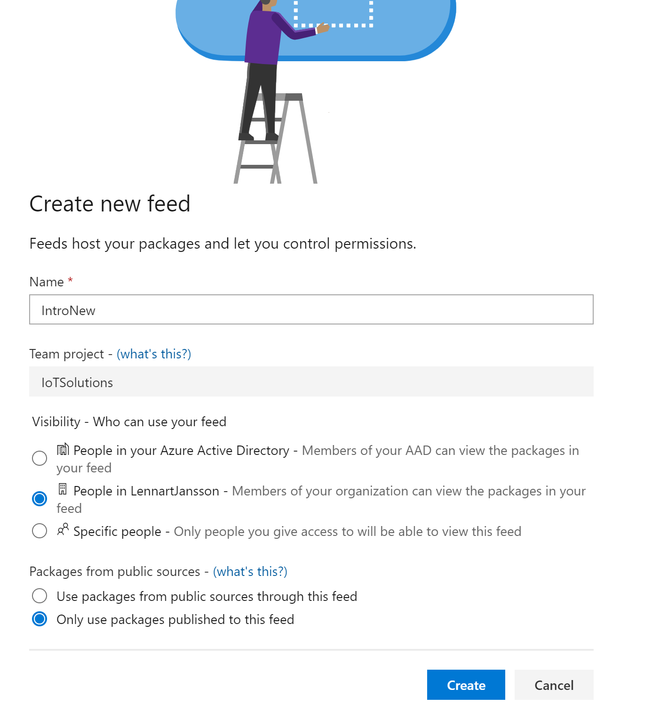

# Artifact feed  

Vi ska nu skapa ett Artifact Feed där vi kan lagra våra NuGet paket, det blir lite som ett NuGet repo i miniatyr.  

Klicka på Artifact ute till vänster, du får nu upp följande bild om du inte gjort detta steg tidigare.  

  

Klicka på knappen Create Feed och i nästa bild fyll i följande:  

  

Fortsätt till nästa dokument för att se hur man sedan deployar dessa NuGet paket till Azure DevOps egna Artifact Feed (samma som ett NuGet repo)  

[NuGet Deploy](NuGetDeploy.md)
