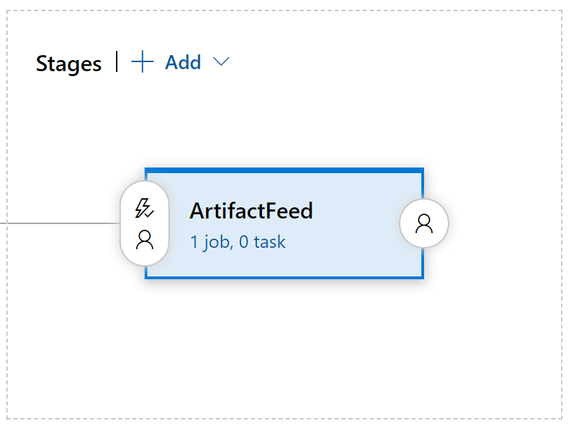
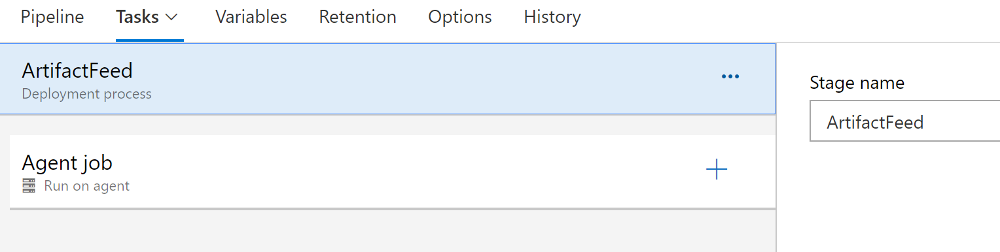
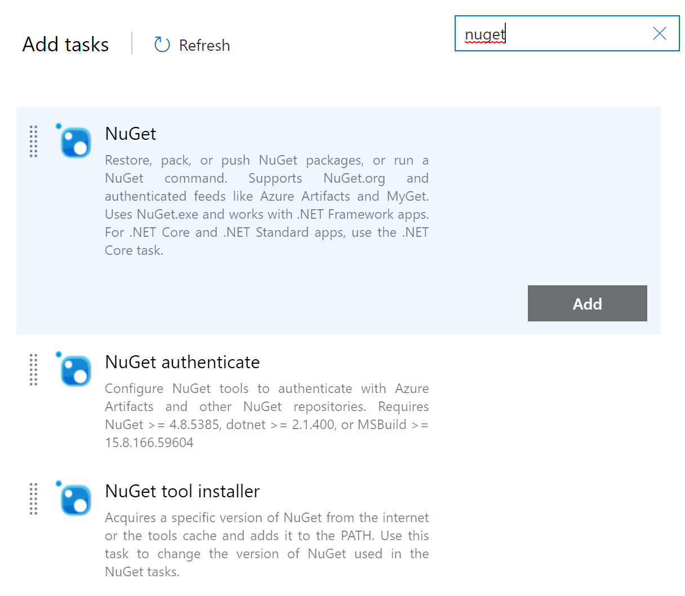
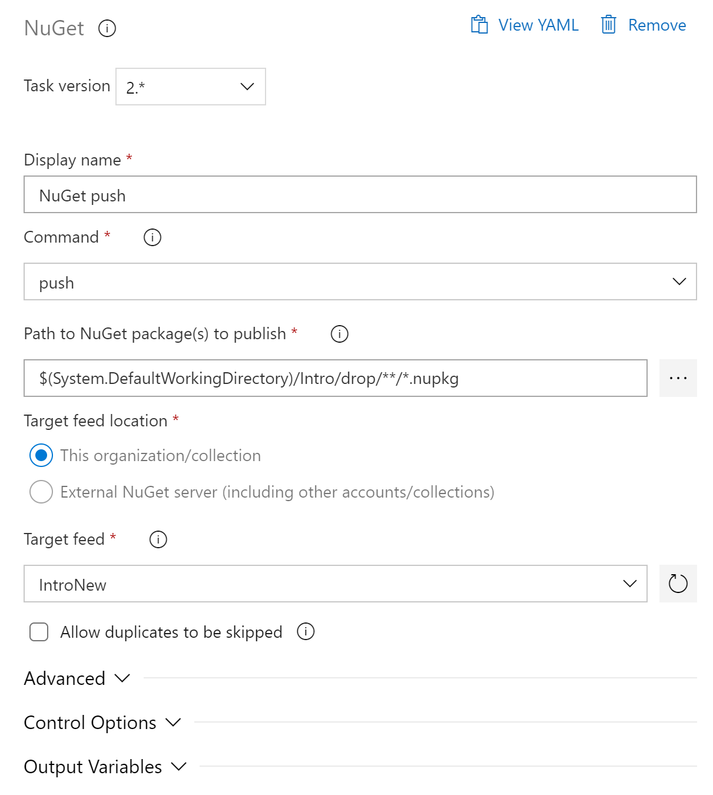
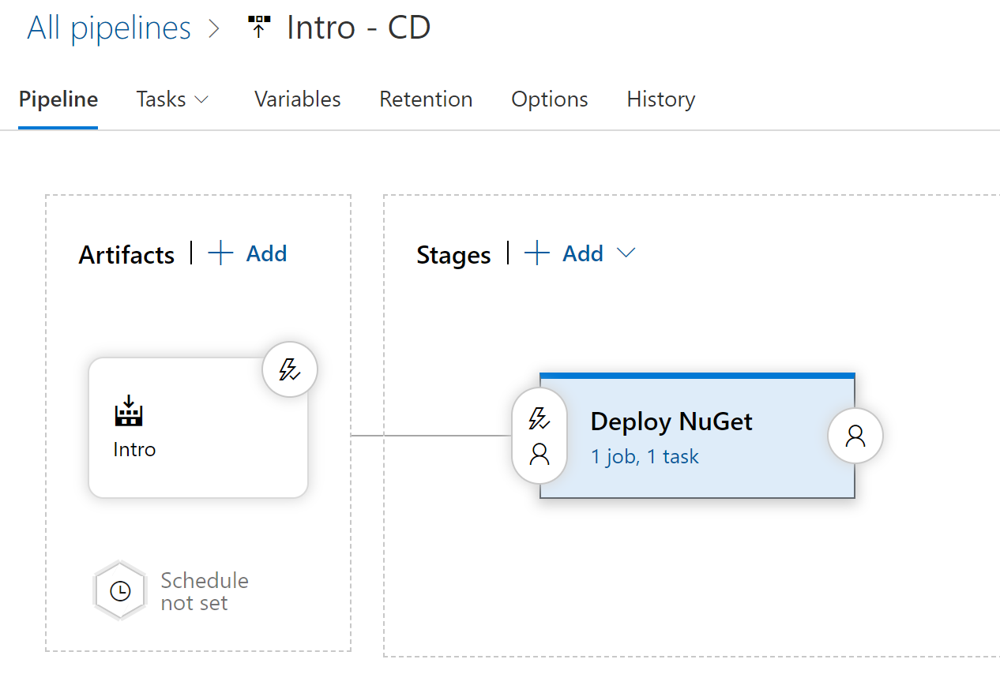

# NuGet Deploy

När bygget är provkört och fungerar så kan man direkt från ett kört bygge välja att skapa en Release. Detta kommer att öppna en dialog där man kan välja en Template, längst upp finns en länk som det står Or start with an Empty job. Välj detta alternativ!  

Nästa steg är att man frågas om namnet på sin första Stage, en stage är ungefär motsvarande en miljö och vad som ska hända i denna miljö, kalla den bara ArtifactFeed och stäng sedan den fliken på krysset.  

I rutan för ArtifactFeed stage ser det nu ut så här:

  

Klicka på länken där det står "0 task" så kommer följande vy fram:  

Klicka på plussymbolen till höger om Agent Job så kommer nästa vy fram i högerkanten:  

Sök som bilden visar efter ordet nuget och välj Add på den översta Task som heter enbart NuGet. Fyll i den med följande information:  

Command ska vara Push, Path to NuGet packages to publish ska vara $(System.DefaultWorkingDirectory)/Intro/drop/**/*.nupkg där Intro är namnet på byggdefinitionen. Man kan bläddra sig dit om man är osäker men glöm inte att lägga till /**/*.nupkg i slutet.  
Target feed location ska vara This Organization/Collection och på Target Feed väljs den Feed som vi skapade i föregående dokument, i detta exempel var det IntroNew.  

Klicka slutligen på Pieline uppe under All Pipelines så följande vy visas:  

  

Klicka på blixtsymbolen i rutan med Artifacts och se till att Continuous Deployment är aktiverat.  

Nu ska allt vara klart och det kan vi testa genom att starta ett bygge, om det kör grönt så kommer en release att skapas automatiskt och en deploy kommer att startas till Artifact Feed. Om allt blir grönt så kan man verifiera detta genom att gå in i Artifact och kolla om paketet går att hitta!  