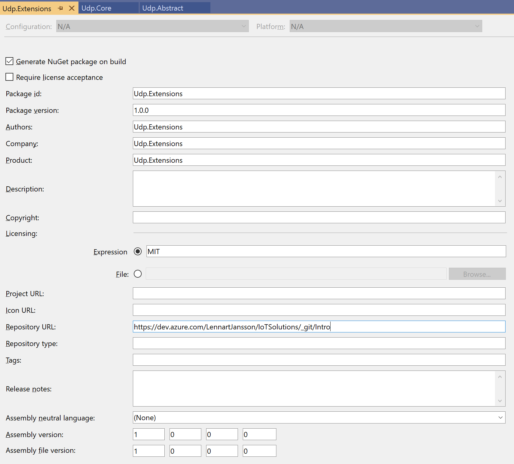

# NuGet Paket  

I det förra exemplet om middlewares såg vi hur man kan skapa middlewares av återanvändbara komponenter. För att kunna återanvända dessa komponenter så behöver man inkludera Udp.Abstract, Udp.Core and Udp.Extension i sin solution på något vis.  

Det absolut lättaste sättet att hantera detta på är att skapa NuGet paket utav var och en av dessa tre komponenter. Genom detta så får vi en tydlig leverabel för komponenterna som är enkel att versionshantera, uppdatera och inkludera.  

Att skapa NuGet paket har blivit otroligt enkelt i Net Core, det räcker med att man öppnar egenskaperna för de projekt man vill göra NuGet paket av och går till fliken som heter Publish, där har man en checkbox som heter Generate NuGet package on build. Fyll i informationen som i nedanstående bild:  

  

Efter detta kommer varje kompilering att generera ett NuGet paket (.nupkg) av detta projekt under bin\Debug eller bin\Release, beroende på vilket man valt att kompilera. Paketet innehåller all information om dependencies mm till andra paket och om man installerar ett sådant paket så kommer det automatiskt att dra ner alla andra paket den behöver.  

I vårt exempel behöver vi som sagt göra NuGet paket av de tre projekten Udp.Abstract, Udp.Core och Udp.Extensions och vi behöver bara lägga till paketet Udp.Extensions till vår solution där vi vill inkludera denna middleware. Om vi har något projekt där vi bara injektar en IUdpListener eller IUdpSpeaker från IOC så räcker det att vi lägger till Udp.Abstract till detta projekt.  

Nästa steg är att automatisera tillverkningen av dessa paket och då flyttar vi över till Azure DevOps, detta beskrivs i nästa dokument, [NuGet Build](NuGetBuild.md)  

Här finns ett exempel som är ungefär likadant, enda skillnaden är att man i det exemplet deployar sitt NuGet paket som en del av Build vilket är strategiskt fel att göra. Build är till för att kompilera och testa, inget annat. Deploy är ett steg i en release process och vi bör kunna hantera att deploya olika states av paketen till olika NuGet feeds. Vidare så innehåller denna websida inget om hur man versionerar sina binärer och NuGet paket! Vår beskrivning däremot innehåller allt detta.  
https://medium.com/@dan.cokely/creating-nuget-packages-in-azure-devops-with-azure-pipelines-and-yaml-d6fa30f0f15e
